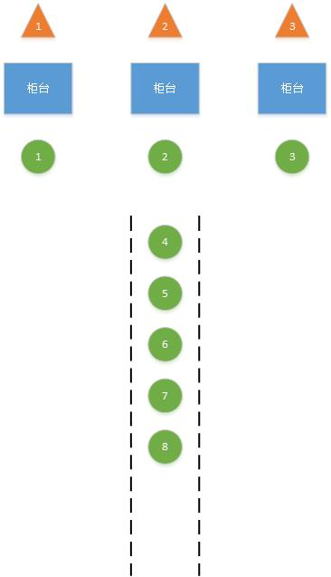
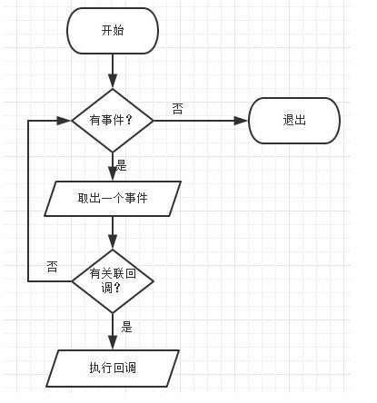

# NodeJS

​	nodejs本身不是开发语言，它是一个工具或者平台，在服务器端解释、运行javascript；

​	nodejs利用Google V8引擎来解释运行javascript，但是系统真正执行的代码是用C++写的。javascript做的只是调用这些API而已。

## NodeJS的三大特点

- **单线程**
- **异步I/O(非阻塞)**
- **事件驱动**

## 运行机制解析

在 Java 和 PHP 这类语言中，每个连接都会生成一个新线程，理论上最大的并发连接数量是 4,000 个用户。随着您的客户群的增长，如果希望您的 Web 应用程序支持更多用户，那么，您必须添加更多服务器。所以在传统的后台开发中，整个 Web 应用程序架构（包括流量、处理器速度和内存速度）中的瓶颈是：服务器能够处理的并发连接的最大数量。这个不同的架构承载的并发数量是不一致的。 
而Node的出现就是为了解决这个问题：更改连接到服务器的方式。在Node 声称它不允许使用锁，它不会直接阻塞 I/O 调用。Node在每个连接发射一个在 Node 引擎的进程中运行的事件，而不是为每个连接生成一个新的线程

举个具体的栗子：我们去银行办理业务，从门口的机器里面拿到一个号，一般有多个窗口在办业务（**多线程**），当叫到我们的号时，我们去特定的窗口把我们要办的事情都办完（**阻塞性**），然后下一个人。如下图：



假如有了更高效的NodeJS银行开张了，你发现这个银行竟然只有一个业务窗口（**单线程**）。你也会拿到一个号，但是当你被叫到号时，你发现业务员竟然不亲自帮你办任务，而是让你把你要办的事情直接写个列表给他之后就让你滚蛋了（**非阻塞**）。但是，喂，我的事情还没办完啊！银行告诉你，你的事情不是窗口的业务员办的，而是业务员后面的内部人员办的（**Event Loop**）。你可以继续等听广播，如果你的号码代表的事情做完了，广播再次叫你的号。如果你不关心结果，你可以直接走人（事情办完），或者你可以等事情真的办完，再次叫你的号继续办其他事情(CallBack)，如下图：


(注意工作区里面的办事方式也不是一个人拿一个事情傻干，数据库操作，文件操作、网络操作等一些阻塞的事情会有单独的人去做)

> Node.js运行一个实例之后，是单进程多线程的，这里面，有的线程负责V8引擎解析JavaScript,有的线程负责事件循环;

Node.js的单线程并不是真正的单线程，只是开启了单个线程进行业务处理（cpu的运算），同时开启了其他线程专门处理I/O。当一个指令到达主线程，主线程发现有I/O之后，直接把这个事件传给I/O线程，不会等待I/O结束后，再去处理下面的业务，而是拿到一个状态后立即往下走，这就是“单线程”、“异步I/O”。 



I/O操作完之后呢？Node.js的I/O 处理完之后会有一个回调事件，这个事件会放在一个事件处理队列里头，在进程启动时node会创建一个类似于While(true)的循环，它的每一次轮询都会去查看是否有事件需要处理，是否有事件关联的回调函数需要处理，如果有就处理，然后加入下一个轮询，如果没有就退出进程，这就是所谓的“事件驱动”。这也从Node的角度解释了什么是”事件驱动”。 
在node.js中，事件主要来源于网络请求，文件I/O等，根据事件的不同对观察者进行了分类，有文件I/O观察者，网络I/O观察者。事件驱动是一个典型的生产者/消费者模型，请求到达观察者那里，事件循环从观察者进行消费，主线程就可以马不停蹄的只关注业务不用再去进行I/O等待。


## nodejs局限性

### 单线程意味着单点失败

在NodeJS里面你要非常小心的处理所有的错误，由于默认单线程，所有未处理/捕获的错误都会造成整个服务器结束。写的时候多考虑边缘条件，失败处理，如何抛错！

### 程序逻辑实现方式和传统的不同了（异步、异步、异步）

就拿上面银行的例子来说，效率是提高了，但是如果你不是只办一件事情的话，办的流程复杂了。传统银行里，比如你要：从A转1000到B，再把B里面所有钱都转到C账户。你排到号之后，坐下来，和服务员说你要顺序做下面两件事:

- （一）A账户转账B,1000
- （二）把B账户所有的钱转到C账户上

是绝对不会有问题的。最后B账户的余额是0.

如果在NodeJS银行，你排到号，告诉柜员你要做（一）和（二）两件事情，基本上，出来的结果和你想要的很有可能是不一样的。为什么？因为在异步机制下，（一）和（二）只是顺序触发的两个任务而已，（二）的开始和（一）的完成在时间上没有先后的顺序关系，很大几率下，最后的结果是B账户里还剩下1000，而不是你期望的0。

> 在事件处理过程中，它会[智能](http://lib.csdn.net/base/aiplanning)地将一些涉及到IO、网络通信等耗时比较长的操作，交由worker threads去执行，执行完了再回调，这就是所谓的异步IO非阻塞吧。但是，那些非IO操作，只用CPU计算的操作，它就自己扛了，这些自己扛的任务要一个接着一个地完成，前面那个没完成，后面的只能干等。因此，对CPU要求比较高的CPU密集型任务多的话，就有可能会造成号称高性能，适合高并发的node.js服务器反应缓慢。

## 同步 vs 异步

得益于异步的机制，NodeJS在拥有卓越性能的同时，也会使逻辑的实现变得更复杂和难于理解。

首先，其实NodeJS也是能实现blocking的代码的，比如读取一个文件：

```
var fs = require("fs");

var contents = fs.readFileSync("data.txt", "utf8");

console.log(contents);

console.log("done");
```

这样写的输出结果就是先读取打印文件的内容，再输出`done`.

但是，这样就失去了使用NodeJS的优势，而且，绝大部分的库（比如文件的读取，数据库的操作等）都是使用异步机制，并且不提供类似fs的sync同步方法，而一般的Callback写法应该是这样的：

```
var fs = require("fs");

fs.readFile("data.txt", "utf8", function(err, contents) {
    if(err) {
        errorHandler();
    }
    console.log(contents);
});

console.log("done");
```

需要注意的是，这样的写的话，输出的顺序就是`done`之后再是文件的内容了。

NodeJS一般的异步实现方式：

```
someThing.someFunction(param...,callback);
```

用通俗的话解释就是:因为是异步，所以当你派发任务的时候，请直接告诉我这件事完成之后该干什么，而不是等我做完了之后再告诉我。

## nodejs适用场景

**实时程序**

比如聊天服务([案例](https://microzz.com/vue-chat))

聊天应用程序是最能体现 Node.js 优点的例子：轻量级、高流量并且能良好的应对跨平台设备上运行密集型数据。同时，聊天也是一个非常值得学习的用例，因为它很简单。

单页APP

ajax很多。现在单页的机制似乎很流行，比如phonegap做出来的APP

总而言之，NodeJS适合运用在高并发、I/O密集、少量业务逻辑的场景

## Node+mongodb--demo

### 后端

- Express

### 数据库

- mongoDB([MongoDB安装配置和启动](http://note.youdao.com/noteshare?id=ada2052d417d6dec0799ccf380073aee))

### 主要依赖包

- express-session
- mongoose([API](http://cnodejs.org/topic/504b4924e2b84515770103dd))
- express-validator
- md5
- passport
- connection-mongo
- [官方包](http://nodejs.cn/api/events.html)

**个人看法：node上手so easy，实际应用到项目中就需要积累各种模块和中间件的坑；**